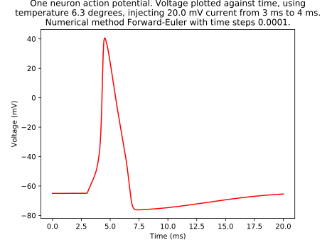
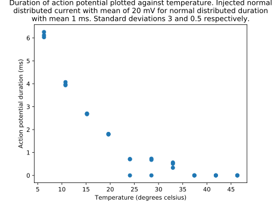
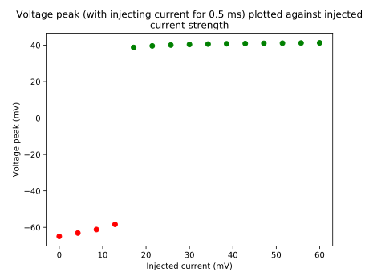

# Project Computational Science: The Hodgkin-Huxley model
*Note: For code review, read Code_review.txt or the Code review instructions section below.*
*Both contain the same instructions.*

This repository contains all code and files used by Mark Bebawy, Lucas Riedstra & Jim Wagemans (Group 4)
for the Project Computational Science course of the University of Amsterdam.

## Files
### Folder 'articles'
This folder contains all pdfs that we used to understand the Hodgkin-Huxley model and
the basic neuro-science that we needed for our project.

### Folder 'code'
Our implementation of the Hodgkin-Huxley model, experiments on and verification of
this model, and a GUI to run these experiments and use different parameters.

*Execution is done by navigating to this folder and running 'python3 gui.py'.*
This opens a GUI where parameters can be filled and different experiments can be run,
namely the simulation of one action potential, the running of temperature experiments
and the verification of the model. See the GUI for details.

#### experiments.py
A class for the temperature experiments. This class is a child of the abstract parameter experiment class.
This class allows to test the effect of changing any parameter on AP duration.

## animation.py
Code for running animation. Run to generate animation of action potential.

#### gui.py
Code for generating the GUI.

#### hh.py
Code for implementing the Hodgkin-Huxley model.

#### tools.py
Methods for solving ordinary differential equations (Runge-Kutta 4 and Forward Euler).

#### validation.py
Code for model verification. This is done by checking if the model obeys
the [all-or-nothing principle](https://en.wikipedia.org/wiki/All-or-none_law).

------------------
### Folder 'figures'
Contains three *.svg files, these are three figures that we used to draw conclusions about the
Hodgin-Huxley model and in particular about the effects of temperature on the speed of an action potential.
The figures are shown below.

### Folder 'proposal'
This folder contains our project proposal and the feedback that we received on it.

### Code_review.txt
Instructions for reproducing the .svg figures above (same content as Code review instructions
section below).

### README.md
The file to produce what you are reading right now.

------------------
## Code review instructions
*Needed:*
- *Linux machine (terminal)*
- *python3 with numpy and matplotlib*

We made three interesting figures to showcase our model: action_potential.svg, temperature_exp.svg, verification.svg.

All the figures can be reproduces using the GUI, which is started by running 'python3 gui.py' from the 'code/' folder.
This will open a window where a bunch of paramaters can be filled. Do not change any of the default parameters,
as these values are used to genereate the three figures in this folder. If you accidently change some values,
simply close the GUI with the 'Quit' button and run 'python3 gui.py' again. The default values will be restored that way.

### Reproduce action_potential.svg
1. open a terminal and navigate to the 'code/' folder.
    (From the folder in which this file is: 'cd code/'.)
2. run 'python3 gui.py'
3. There are four buttons on the screen: press 'Option 1 Simulate action potential'.
4. Wait for a couple of seconds.

### Reproduce temperature_exp.svg
1. open a terminal and navigate to the 'code/' folder.
    (From the folder in which this file is: 'cd code/'.)
2. run 'python3 gui.py'
3. There are four buttons on the screen: press 'Option 2 Run temperature experiments'.
4. Wait for some time (see terminal for progress).

### Reproduce verification.svg
1. open a terminal and navigate to the 'code/' folder.
    (From the folder in which this file is: 'cd code/'.)
2. run 'python3 gui.py'
3. There are four buttons on the screen: press 'Model verification'.
4. Wait for some time (see terminal for progress).
Note: this figure takes the longest time to reproduce.
