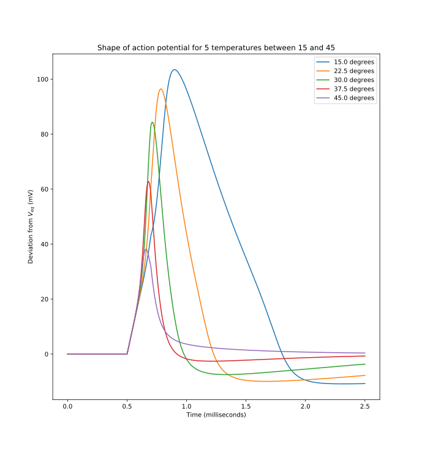
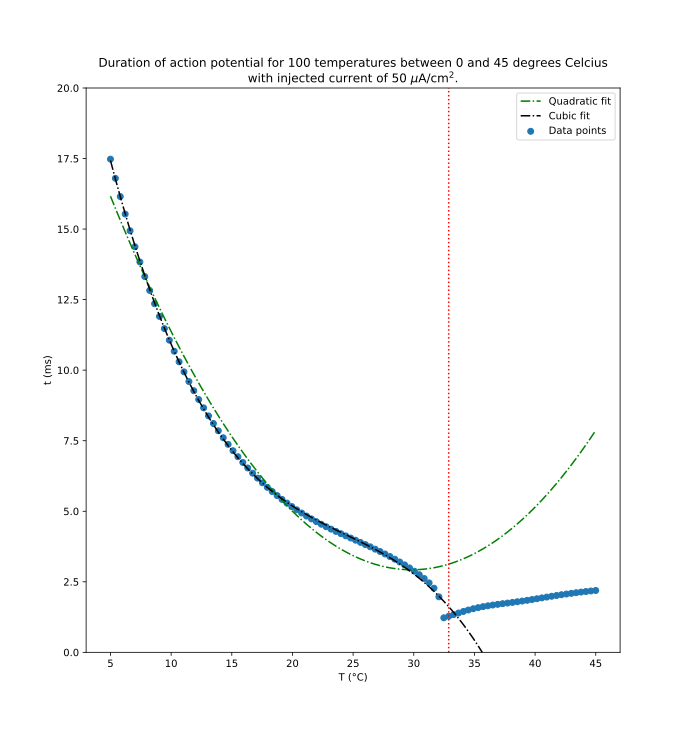

# Project Computational Science: The Hodgkin-Huxley model
*Note: For code review, read Code_review.txt or the Code review instructions section below.*
*Both contain the same instructions.*

This repository contains all code and files used by Mark Bebawy, Lucas Riedstra & Jim Wagemans (Group 4)
for the Project Computational Science course of the University of Amsterdam.

If you are interested in doing your own experiments with
the Hodgkin & Huxley model (by changing
certain parameters of the model to run temperature experiments
or simulate action potentials), you can use our graphical
user interface. This GUI is started by running 'python3 gui.py' from inside the 'code/' folder.
This will open a window where a bunch of paramaters can be filled and buttons can be pressed to generate figures.

---
## Machine requirements
- Linux machine (terminal);
- python3 with modules:
    - numpy
    - matplotlib (pyplot)
    - csv
    - os
    - matplotlib.animation (for animation.py)
    - tkinter (for the GUI)

---
## Files
### Folder 'articles'
This folder contains all pdfs that we used to understand the Hodgkin-Huxley model and
the basic neuro-science that we needed for our project.

------------------
### Folder 'code'
Our implementation of the Hodgkin-Huxley model, experiments on and verification of
this model, and a GUI to run these experiments and use different parameters.

*Execution is done by navigating to this folder and running 'python3 gui.py'.*
This opens a GUI where parameters can be filled and different experiments can be run,
namely the simulation of one action potential, the running of temperature experiments
and the verification of the model. See the GUI for details.

*Note: if the loading of the screen takes too long, use Ctrl+C and run it again.*

#### Folder 'stored_figs'
The GUI provides an option to store experiment results in csv files, given
a file name. All this files are stored in this folder. You should only
specify the name of the file, and it will automatically be placed in this folder.

#### animation.py
Code for running animation. Run to generate animation of action potential.

#### experiments.py
A class for the temperature experiments. This class is a child of the abstract parameter experiment class.
This class allows to test the effect of changing any parameter on AP duration.

#### gui.py
Code for generating the GUI.

#### hh.py
Code for implementing the Hodgkin-Huxley model.

#### poster_figures.py
Code for generating figures used for our poster and for the code review.

#### results_100_deter_1.csv
File containing data to plot figure for code review.

#### tools.py
Implementation of methods for solving ordinary differential equations (Runge-Kutta 4 and Forward Euler)
and for the shooting method to solve a partial differential equation from the HH-model.

#### validation.py
Code for model verification. This is done by checking if the model obeys
the [all-or-nothing principle](https://en.wikipedia.org/wiki/All-or-none_law).

------------------
### Folder 'figures'
Contains our scientific poster *(POSTER_PCS_GROUP4.pdf)*, all figures
used in our poster and report, and a folder containing the figures for the code review.

#### Folder 'review_figures'
*Note: Use these figures for the code review.*

This folder contains two *.svg files, these are two figures that we used to draw conclusions about the
Hodgin-Huxley model and in particular about the effects of temperature on the speed of an action potential.

The figures are shown in the code review section.

---
### Folder 'proposal'
This folder contains our project proposal and the feedback that we received on it.

---
### Code_review.txt
Instructions for reproducing the .svg figures above (same content as Code review instructions
section below).

---
### README.md
The file to produce what you are reading right now.


------------------
## Code review instructions
*Needed:*
- *Linux machine (terminal);*
- *python3 with following modules, which UvA students should automatically have:*
    - *numpy*
    - *matplotlib (pyplot)*
    - *csv*
    - *os*

We made two interesting figures to showcase our model (which can be found in the folder 'figures/review_figures' and are shown below): large_temp_exp.svg, multipe_ap.svg.

Both figures are generated by the 'poster_figures.py' script
in the 'code' folder. There is a fast way to reproduce
these figures, using data present in a csv file in the 'code' folder (this
data is for 'large_temp_exp.svg', data for 'multiple_ap.svg' is not stored),
and there is a slow way to reproduce the figures, by running
all experiments yourself (which will recalculate the data
present in the csv file).

First clone this repository and go to the root folder of the repository.

### Fast: reproduce figures using csv
1. Open a terminal and navigate to the 'code/' folder.
    (From the folder in which this file is: `cd code/`.)
2. Run: `python3 poster_figures.py`
3. Wait for a couple of seconds: first the 'multiple_ap.svg' figure is shown. Compare it as you like and close the figure (by pressing q or using the x on the window).
4. Now 'large_temp_exp.svg' is shown.

### Slow: recalculate data and show figures
*Note: The temperature experiments take quite a long time to finish.*
1. Open a terminal and navigate to the 'code/' folder.
    (From the folder in which this file is: `cd code/`.)
2. Open a python interpreter (run `python3`)
3. Import poster_figures.py:
    ```python
    import poster_figures as posterf
    ```
4. To generate 'multiple_ap.svg' run the following:
    ```python
    posterf.multiple_ap_plot()
    ```
5. To generate 'large_temp_exp.svg' run the following *(and wait for a very long time):*
    ```python
    posterf.large_temp_exp()
    ```
6. To show 'large_temp_exp.svg' the fast way, using the data from the csv file 'results_100_deter_1.csv', run the following:
    ```python
    posterf.plot_temp_exp_polyfit()
    ```

If you are interested in doing your own experiments with
the Hodgkin & Huxley model (by changing
certain parameters of the model to run temperature experiments
or simulate action potentials), you can use our graphical
user interface. This GUI is started by running `python3 gui.py` from inside the 'code/' folder.
This will open a window where a bunch of paramaters can be filled and buttons can be pressed to generate figures.

### multiple_ap.svg


### large_temp_exp.svg

